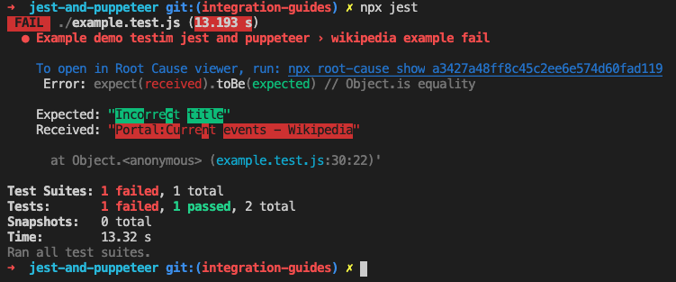

# [Draft][WIP] Testim Root Cause integration guide

To read about the benefits of using Root Cause, see: XXX

<!-- ## Playwright & Puppeteer friendly

Testim Root Cause can work with playwright and puppeteer in a similar manner. -->

## Jest and Puppeteer
[Example project](https://github.com/testimio/root-cause/tree/master/integration-examples/jest-and-puppeteer)

Root Cause assume you already have global browser page available in your jest setup.
The following example assume you are using the popular [jest-puppeteer](https://github.com/smooth-code/jest-puppeteer) package.  

### Install the `@testim/root-cause-jest` package.

```sh
npm install testim/root-cause-jest
```

### Update your jest.config.js
```js
const puppeteerPreset = require('jest-puppeteer-preset/jest-preset.json');

const runId = Date.now().toString();

module.exports = {
    ...puppeteerPreset,
    reporters: [
        ['@testim/root-cause-jest/lib/reporter/default', { runId }],
    ],
    setupFilesAfterEnv: [
        ...puppeteerPreset.setupFilesAfterEnv,
        '@testim/root-cause-jest/lib/forSetupFilesAfterEnv'
    ],
    globals: {
        runId,
    },
};

```
### Run your test
After the config change, you can run jest as usual.
```sh
npx jest
```
If there are no failing tests, Root Cause will inject the command to run to view the failing test analysis (See the following screenshot)



```
npx root-cause show a3427a48ff8c45c2ee6e574d60fad119
```

### View results
To view the full test list, and open the viewer for passing tests, read the Root Cause CLI section ahead.

## Jest and Playwright
[Example project](https://github.com/testimio/root-cause/tree/master/integration-examples/jest-and-playwright)

The instructions are the same as with Puppeteer, but the jest config change.
Assuming you are using the popular jest-playwright package, your jest config should look like:
```js
const playwrightPreset = require('jest-playwright-preset/jest-preset.json');

const runId = Date.now().toString();

module.exports = {
    ...playwrightPreset,
    testRunner: 'jasmine2',
    reporters: [
        ['@testim/root-cause-jest/lib/reporter/default', { runId }],
    ],
    setupFilesAfterEnv: [
        ...playwrightPreset.setupFilesAfterEnv,
        '@testim/root-cause-jest/lib/forSetupFilesAfterEnv'
    ],
    globals: {
        runId,
    },
};

```
The rest of the steps are the same.

## Mocha
[Example project](https://github.com/testimio/root-cause/tree/master/integration-examples/mocha-and-puppeteer)

## launch api
[Example project](https://github.com/testimio/root-cause/tree/master/integration-examples/launch-api)

## Root Cause CLI

## Config file
